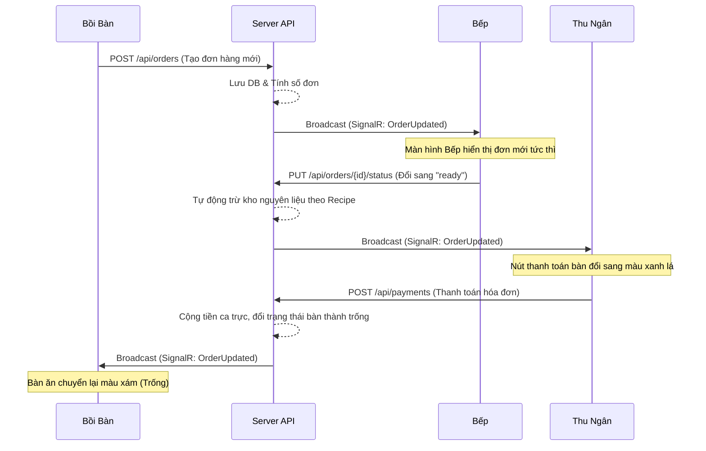

# 🍜 Hệ Thống POS Quản Lý Quán Bánh Canh Cá Lóc Realtime

Dự án POS (Point of Sale) chuyên nghiệp, đồng bộ thời gian thực (realtime) dành cho chuỗi nhà hàng hoặc quán ăn Bánh Canh Cá Lóc. Hệ thống hỗ trợ tối ưu quy trình từ khâu bồi bàn gọi món, bếp chế biến, thủ kho nhập/xuất nguyên liệu cho đến thu ngân tính tiền và chủ quán theo dõi báo cáo doanh thu tức thì.

---

## 🏗️ Kiến Trúc Hệ Thống

Hệ thống được xây dựng trên mô hình Client-Server hiện đại, áp dụng **Clean Architecture** kết hợp với **DDD (Domain-Driven Design)** và **CQRS (MediatR)** ở phía backend để đảm bảo mã nguồn dễ bảo trì và kiểm thử:

*   **Frontend**: React (Vite) + Tailwind CSS + Lucide Icons + Recharts (Biểu đồ).
*   **Backend (Clean Architecture)**: ASP.NET Core Web API (.NET 9.0) + Entity Framework Core.
*   **Cơ sở dữ liệu**: Microsoft SQL Server (16 bảng quan hệ tối ưu hóa hiệu năng).
*   **Realtime Communication**: ASP.NET Core SignalR (WebSocket).
*   **Xác thực bảo mật**: JWT Bearer Tokens & mã hóa mật khẩu một chiều BCrypt trên server.

---

## 🌟 Tính Năng Nổi Bật

1.  **Quản lý Sơ đồ bàn & Khu vực động**: 
    *   Tự động nhóm bàn ăn theo từng khu vực (Trong nhà, Ngoài trời,...).
    *   Hiển thị trực quan trạng thái bàn ăn (Trống / Có khách) thời gian thực.
2.  **Order & POS Bán Hàng**:
    *   Thiết kế giao diện thích ứng tốt trên cả máy tính bảng và di động (Mobile Responsive).
    *   Nhân viên dễ dàng chọn bàn, lên đơn món ăn kèm ghi chú, thêm món mới vào hóa đơn hiện có.
3.  **Đổi món & Hủy đơn hàng nâng cao (Khách Hàng Là Thượng Đế)**:
    *   Cho phép hủy đơn hàng và thay đổi giỏ hàng đã gọi.
    *   Không hoàn trả nguyên vật liệu thô khi hủy đơn hàng đã chế biến xong (`ready`) để phản ánh đúng thực tế hao hụt nguyên liệu thô đã qua chế biến; không ảnh hưởng các đơn chưa chế biến.
    *   Nếu đơn hàng đã chế biến xong (`ready`) nhưng khách vẫn muốn đổi món, hệ thống hiển thị pop-up cảnh báo ngắn gọn qua `ConfirmDialog` hệ thống. Nếu đồng ý, backend sẽ **chỉ trừ thêm nguyên vật liệu cho những món tăng thêm hoặc thêm mới**. Món giảm đi/bị xóa sẽ không hoàn kho (tính vào hao hụt).
    *   Trạng thái đơn hàng cập nhật được đồng bộ thời gian thực qua SignalR trên các màn hình.
4.  **Điều Phối Bếp Realtime (Kitchen Page)**:
    *   Màn hình bếp tự động nhận đơn hàng ngay khi bồi bàn xác nhận (không cần tải lại trang).
    *   Cập nhật trạng thái chế biến (`Chờ chế biến` -> `Đang chế biến` -> `Sẵn sàng`).
5.  **Tối ưu hóa giao diện Bếp (KDS) & Chế độ dịu mắt (Eye-care)**:
    *   **Chế Độ Dịu Mắt (Cozy Eye-Care Mode)**: Khi bật, giao diện bếp chuyển sang tông màu trầm ấm dịu nhẹ (`bg-[#0d0c0b] text-zinc-300`), giảm độ tương phản chói của văn bản.
    *   **Bộ Lọc Giảm Chói Độ Sáng (In-App Dimmer)**: Tích hợp thanh trượt giảm độ sáng trực tiếp ngay trên trang giúp nhân viên bếp dim màn hình độc lập với cài đặt phần cứng.
    *   **Thay Đổi Kích Thước Chữ (Font Size Adjuster)**: 3 mức kích thước chữ nhanh (Vừa, Lớn, To) giúp đọc chính xác từ khoảng cách xa (2-3 mét).
    *   **Âm Thanh Báo Đơn Mới (Audio Chime)**: Tự động phát tiếng chuông chime 2 âm điệu bằng **Web Audio API** khi có order mới đổ xuống bếp.
6.  **Tự Động Khấu Trừ Kho Nguyên Liệu**:
    *   Tự động tính toán và khấu trừ nguyên liệu trong kho thực tế khi món ăn chuyển sang trạng thái `Sẵn sàng` (dựa trên công thức định lượng định sẵn của món đó).
    *   Tự động bắn thông báo lỗi (Toast) nếu nguyên liệu chạm ngưỡng cảnh báo tồn kho thấp.
7.  **Quản Lý Kho (Inventory)**:
    *   Ghi nhận nhật ký nhập kho thực phẩm, tạo phiếu hủy nguyên liệu hỏng/hết hạn.
    *   Cung cấp chức năng kiểm kê điều chỉnh chênh lệch kho lý thuyết và thực tế.
8.  **Báo Cáo & Phân Tích (Dashboard & Reports)**:
    *   Thống kê KPIs quan trọng (Doanh thu ngày, Hóa đơn phát sinh, Tồn kho thấp).
    *   Biểu đồ doanh thu trực quan 7 ngày qua, so sánh hiệu suất doanh thu theo tuần, tháng.
9.  **Quản lý Ca Làm Việc (Shifts)**:
    *   Nhân viên bắt buộc mở ca trước khi bán hàng.
    *   Khi kết thúc ca, hệ thống tự động tính toán tổng số tiền thực tế thu về và số hóa đơn đã thanh toán.
10. **Hộp thoại Confirm và Toast chuyên nghiệp**:
    *   Toàn bộ các thông báo hành động quan trọng được chuyển sang sử dụng `ConfirmDialog` và `Toast` tùy chỉnh đẹp mắt, loại bỏ hoàn toàn các hộp thoại mặc định của trình duyệt/Windows.

---

## 📁 Cấu Trúc Thư Mục

```text
banh-canh-ca-loc/
├── app/                              # Frontend React (Client POS)
│   ├── public/                       # Assets tĩnh (logo, favicon...)
│   ├── src/
│   │   ├── api/                      # Client Axios cấu hình JWT (apiClient.js)
│   │   ├── components/               # Components dùng chung (Layout, TableForm, các UI Dialog...)
│   │   │   └── ui/                   # Các UI atomic components (confirm, button, dialog, input, label...)
│   │   ├── hooks/                    # Custom React hooks (use-toast...)
│   │   ├── lib/                      # Thư viện dùng chung (DataContext, appAuth, storage...)
│   │   ├── pages/                    # Các trang nghiệp vụ (Dashboard, Kitchen, Orders, Menu, Inventory...)
│   │   ├── utils/                    # Các hàm tiện ích dùng chung
│   │   ├── App.jsx                   # Component định tuyến và khởi tạo app
│   │   └── main.jsx                  # Điểm khởi đầu của ứng dụng React
│   ├── package.json                  # Cấu hình dự án và dependencies
│   ├── tailwind.config.js            # Cấu hình Tailwind CSS
│   └── vite.config.js                # Cấu hình Vite bundler
├── backend/                          # Backend ASP.NET Core Web API (Clean Architecture)
│   ├── src/
│   │   ├── BanhCanhCaLoc.Domain/     # Core Business Models, Entities, Interfaces
│   │   ├── BanhCanhCaLoc.Application/# Application Core, CQRS (MediatR), Validators, Commands/Queries
│   │   ├── BanhCanhCaLoc.Infrastructure/# Persistence, AppDbContext, Repositories, SignalR Hubs
│   │   └── BanhCanhCaLoc.Api/        # Controllers, Middlewares, API Endpoints, Program.cs
│   ├── tests/
│   │   ├── BanhCanhCaLoc.ArchTests/  # Architecture tests
│   │   ├── BanhCanhCaLoc.UnitTests/  # Unit tests for Business Logic
│   │   └── BanhCanhCaLoc.IntegrationTests/ # Integration tests for DB/EF Core
│   └── BanhCanhCaLoc.sln             # Solution của dự án .NET
└── database/                         # Thư mục quản lý sao lưu/khôi phục CSDL
    ├── backups/                      # Chứa các file sao lưu .bak
    ├── backup.ps1                    # Script tự động backup CSDL
    ├── restore.ps1                   # Script tự động khôi phục CSDL
    └── README.md                     # Hướng dẫn chi tiết quy trình backup
```

---

## 🚀 Hướng Dẫn Cài Đặt & Khởi Chạy

### Yêu cầu chuẩn bị
*   [.NET SDK 9.0](https://dotnet.microsoft.com/download)
*   [Node.js](https://nodejs.org/) (Phiên bản v18 trở lên)
*   [SQL Server](https://www.microsoft.com/en-us/sql-server/sql-server-downloads) (Express hoặc Developer Edition)

---

### Bước 1: Cấu hình Cơ sở dữ liệu SQL Server
Mở file cấu hình tại [appsettings.json](file:///d:/WORK_SPACE/CodingProject/banh-canh-ca-loc/backend/src/BanhCanhCaLoc.Api/appsettings.json) và điều chỉnh chuỗi kết nối phù hợp với máy của bạn:

```json
"ConnectionStrings": {
  "DefaultConnection": "Server=YOUR_SERVER_NAME;Database=BanhCanhCaLoc;User Id=sa;Password=YOUR_PASSWORD;TrustServerCertificate=True;"
}
```

---

### Bước 2: Khởi chạy Backend Web API
1.  Di chuyển vào thư mục backend API:
    ```bash
    cd backend/src/BanhCanhCaLoc.Api
    ```
2.  Chạy Migration để tạo cấu trúc cơ sở dữ liệu trên SQL Server (nếu chạy lần đầu):
    ```bash
    dotnet ef database update
    ```
3.  Khởi chạy Server API:
    ```bash
    dotnet run
    ```
    *Server API sẽ chạy mặc định tại địa chỉ: `http://localhost:5277`*

*(Khi khởi động lần đầu, hệ thống sẽ tự động gọi lớp `DbInitializer` để nạp đầy đủ dữ liệu mẫu bao gồm món ăn, bàn ăn, nguyên liệu kho ban đầu).*

---

### Bước 3: Khởi chạy Frontend React
1.  Mở một cửa sổ dòng lệnh mới và di chuyển vào thư mục frontend:
    ```bash
    cd app
    ```
2.  Cài đặt các thư viện phụ thuộc:
    ```bash
    npm install
    ```
3.  Chạy ứng dụng khách ở chế độ phát triển:
    ```bash
    npm run dev
    ```
    *Frontend Client sẽ chạy tại địa chỉ: `http://localhost:5173`*

---

## 💾 Sao Lưu & Khôi Phục Cơ Sở Dữ Liệu (Backup & Restore)

Hệ thống cung cấp sẵn các công cụ tự động hóa quá trình sao lưu và khôi phục CSDL trong thư mục [database/](file:///d:/WORK_SPACE/CodingProject/banh-canh-ca-loc/database/):

*   **Sao lưu (Backup)**: Chạy script `./database/backup.ps1` để tự động tạo file `.bak` lưu trữ tại `database/backups/`.
*   **Khôi phục (Restore)**: Chạy script `./database/restore.ps1 -BackupFile "database/backups/file_name.bak"` để khôi phục trạng thái dữ liệu.
*   *Để biết chi tiết cách thực hiện bằng câu lệnh hoặc qua giao diện SSMS, vui lòng tham khảo [Tài liệu hướng dẫn Backup & Restore](file:///d:/WORK_SPACE/CodingProject/banh-canh-ca-loc/database/README.md).*

---

## 🔑 Tài Khoản Mặc Định (Seed Data)

Bạn có thể đăng nhập bằng các tài khoản mẫu sau để trải nghiệm hệ thống:

| Vai Trò | Tên Đăng Nhập | Mật Khẩu | Quyền Hạn |
| :--- | :--- | :--- | :--- |
| **Chủ Quán (Admin)** | `admin` | `admin123` | Toàn quyền cấu hình Thực đơn, Kho, Nhân viên, xem Báo cáo. |
| **Thu Ngân (Cashier)** | `cashier01` | `cashier123` | Quản lý hóa đơn, thanh toán order bàn ăn. |
| **Đầu Bếp (Kitchen)** | `kitchen01` | `kitchen123` | Xem danh sách order món và làm món bếp realtime. |
| **Bồi Bàn (Waiter)** | `waiter01` | `waiter123` | Xem sơ đồ bàn ăn và lên đơn gọi món. |

---

## 🔄 Luồng Đồng Bộ Realtime (SignalR Flow)

