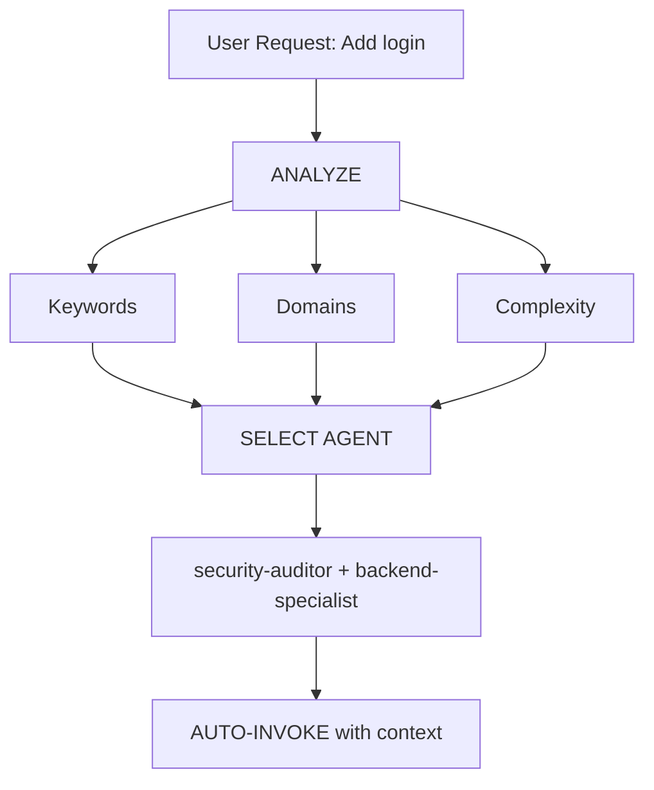

# Intelligent Agent Routing

**Purpose**: Automatically analyze user requests and route them to the most appropriate specialist agent(s) without requiring explicit user mentions.

## Core Principle

> **The AI should act as an intelligent Project Manager**, analyzing each request and automatically selecting the best specialist(s) for the job.

## How It Works

### 1. Request Analysis

Before responding to ANY user request, perform automatic analysis:



### 2. PRISM Task Type Gate (Chạy TRƯỚC Agent Selection)

> **Research basis:** PRISM (arXiv 2603.18507) — Expert personas improve alignment tasks but damage knowledge/accuracy tasks. Gate determines persona depth before routing.

**Step 1: Classify Task Type từ user request:**

| Task Type | Đặc điểm nhận dạng | Keyword signals | Persona Depth |
| --------- | ------------------ | --------------- | ------------- |
| **DISCRIMINATIVE** | Logic, tính toán, debug, fact-check, analysis | "fix", "error", "why", "calculate", "find", "debug", "trace", "analyze" | **MINIMUM** — Agent name only |
| **ALIGNMENT** | Viết code mới, style, format, safety, UX | "create", "build", "design", "write", "implement", "style", "make it" | 🟢 **FULL** — Toàn bộ agent `.md` |
| **HYBRID** | Code review, refactor, architecture | "review", "refactor", "improve", "optimize", "suggest" | 🟡 **SHORT** — Chỉ phần Rules/Core |v

**Step 2: Map Persona Depth → Skill Loading:**

| Persona Depth | Agent File Load | Skill Load | Token Budget (est.) |
| ------------- | --------------- | ---------- | ------------------- |
| MINIMUM | Agent announcement only | Không đọc SKILL.md | ~20 tokens |
| 🟡 SHORT | Chỉ đọc section `## Rules` trong agent `.md` | Đọc SKILL.md index | ~300–500 tokens |
| 🟢 FULL | Đọc toàn bộ agent `.md` | Đọc toàn bộ relevant SKILL.md | Unlimited |

> **PRISM Warning:** Đọc `frontend-specialist.md` (26.8KB ≈ 7,000 tokens) cho một bug fix đơn giản sẽ **giảm accuracy** của response — không tăng.

---

### 3. Agent Selection Matrix

**Use this matrix AFTER PRISM Task Type Gate:**

| User Intent         | Keywords                                   | Selected Agent(s)                           | Task Type | Auto-invoke? |
| ------------------- | ------------------------------------------ | ------------------------------------------- | --------- | ------------ |
| **Authentication**  | "login", "auth", "signup", "password"      | `security-auditor` + `backend-specialist`   | HYBRID | YES |
| **UI Component**    | "button", "card", "layout", "style"        | `frontend-specialist`                       | ALIGNMENT | YES |
| **Mobile UI**       | "screen", "navigation", "touch", "gesture" | `mobile-developer`                          | ALIGNMENT | YES |
| **API Endpoint**    | "endpoint", "route", "API", "POST", "GET"  | `backend-specialist`                        | ALIGNMENT | YES |
| **Database**        | "schema", "migration", "query", "table"    | `database-architect` + `backend-specialist` | HYBRID | YES |
| **Bug Fix**         | "error", "bug", "not working", "broken"    | `debugger`                                  | DISCRIMINATIVE | YES |
| **Test**            | "test", "coverage", "unit", "e2e"          | `test-engineer`                             | HYBRID | YES |
| **Deployment**      | "deploy", "production", "CI/CD", "docker"  | `devops-engineer`                           | HYBRID | YES |
| **Security Review** | "security", "vulnerability", "exploit"     | `security-auditor` + `penetration-tester`   | DISCRIMINATIVE | YES |
| **Performance**     | "slow", "optimize", "performance", "speed" | `performance-optimizer`                     | DISCRIMINATIVE | YES |
| **Product Def**     | "requirements", "user story", "backlog", "MVP" | `product-owner`                          | ALIGNMENT | YES |
| **New Feature**     | "build", "create", "implement", "new app"  | `orchestrator` → multi-agent                | ALIGNMENT | ASK FIRST |
| **Complex Task**    | Multiple domains detected                  | `orchestrator` → multi-agent                | HYBRID | ASK FIRST |

### 4. PRISM-Enhanced Automatic Routing Protocol

## TIER 0 - Automatic Analysis (ALWAYS ACTIVE)

Before responding to ANY request:

```javascript
// PRISM-Enhanced Decision Tree (v2.0)
function analyzeRequest(userMessage) {
    // STEP 1: PRISM Task Type Gate (NEW)
    const taskType = classifyTaskType(userMessage);
    // → "DISCRIMINATIVE" | "ALIGNMENT" | "HYBRID"

    // STEP 2: Determine persona depth based on task type
    const personaDepth = getPersonaDepth(taskType);
    // → "MINIMUM" | "SHORT" | "FULL"

    // STEP 3: Detect domains
    const domains = detectDomains(userMessage);

    // STEP 4: Determine complexity
    const complexity = assessComplexity(domains);

    // STEP 5: Select agent(s)
    const agent = (complexity === "SIMPLE" && domains.length === 1)
        ? selectSingleAgent(domains[0])
        : (complexity === "MODERATE" && domains.length <= 2)
            ? selectMultipleAgents(domains)
            : "orchestrator";

    return { agent, personaDepth };
    // personaDepth controls HOW MUCH of agent.md to load
}
```

## 4. Response Format

**When auto-selecting an agent, inform the user concisely:**

```markdown
**Applying knowledge of `@security-auditor` + `@backend-specialist`...**

[Proceed with specialized response]
```

**Benefits:**

- User sees which expertise is being applied
- Transparent decision-making
- Still automatic (no /commands needed)

## Domain Detection Rules

### Single-Domain Tasks (Auto-invoke Single Agent)

| Domain          | Patterns                                   | Agent                   |
| --------------- | ------------------------------------------ | ----------------------- |
| **Security**    | auth, login, jwt, password, hash, token    | `security-auditor`      |
| **Frontend**    | component, react, vue, css, html, tailwind | `frontend-specialist`   |
| **Backend**     | api, server, express, fastapi, node        | `backend-specialist`    |
| **Mobile**      | react native, flutter, ios, android, expo  | `mobile-developer`      |
| **Database**    | prisma, sql, mongodb, schema, migration    | `database-architect`    |
| **Testing**     | test, jest, vitest, playwright, cypress    | `test-engineer`         |
| **DevOps**      | docker, kubernetes, ci/cd, pm2, nginx      | `devops-engineer`       |
| **Debug**       | error, bug, crash, not working, issue      | `debugger`              |
| **Performance** | slow, lag, optimize, cache, performance    | `performance-optimizer` |
| **SEO**         | seo, meta, analytics, sitemap, robots      | `seo-specialist`        |
| **Game**        | unity, godot, phaser, game, multiplayer    | `game-developer`        |

### Multi-Domain Tasks (Auto-invoke Orchestrator)

If request matches **2+ domains from different categories**, automatically use `orchestrator`:

```text
Example: "Create a secure login system with dark mode UI"
→ Detected: Security + Frontend
→ Auto-invoke: orchestrator
→ Orchestrator will handle: security-auditor, frontend-specialist, test-engineer
```

## Complexity Assessment

### SIMPLE (Direct agent invocation)

- Single file edit
- Clear, specific task
- One domain only
- Example: "Fix the login button style"

**Action**: Auto-invoke respective agent

### MODERATE (2-3 agents)

- 2-3 files affected
- Clear requirements
- 2 domains max
- Example: "Add API endpoint for user profile"

**Action**: Auto-invoke relevant agents sequentially

### COMPLEX (Orchestrator required)

- Multiple files/domains
- Architectural decisions needed
- Unclear requirements
- **Action**: Auto-invoke `orchestrator`. Orchestrator MUST run `/graphify` for short-map discovery to reduce token usage before delegating to specialist agents.
- Example: "Build a social media app"

## Implementation Rules

### Rule 1: Silent Analysis

#### DO NOT announce "I'm analyzing your request..."

- Analyze silently
- Inform which agent is being applied
- Avoid verbose meta-commentary

### Rule 2: Inform Agent Selection

**DO inform which expertise is being applied:**

```markdown
**Applying knowledge of `@frontend-specialist`...**

I will create the component with the following characteristics:
[Continue with specialized response]
```

### Rule 3: Seamless Experience

**The user should not notice a difference from talking to the right specialist directly.**

### Rule 4: Override Capability

**User can still explicitly mention agents:**

```text
User: "Use @backend-specialist to review this"
→ Override auto-selection
→ Use explicitly mentioned agent
```

## Edge Cases

### Case 1: Generic Question

```text
User: "How does React work?"
→ Type: QUESTION
→ No agent needed
→ Respond directly with explanation
```

### Case 2: Extremely Vague Request

```text
User: "Make it better"
→ Complexity: UNCLEAR
→ Action: Ask clarifying questions first
→ Then route to appropriate agent
```

### Case 3: Contradictory Patterns

```text
User: "Add mobile support to the web app"
→ Conflict: mobile vs web
→ Action: Ask: "Do you want responsive web or native mobile app?"
→ Then route accordingly
```

## Integration with Existing Workflows

### With /orchestrate Command

- **User types `/orchestrate`**: Explicit orchestration mode
- **AI detects complex task**: Auto-invoke orchestrator (same result)

**Difference**: User doesn't need to know the command exists.

### With Socratic Gate

- **Auto-routing does NOT bypass Socratic Gate**
- If task is unclear, still ask questions first
- Then route to appropriate agent

### With GEMINI.md Rules

- **Priority**: GEMINI.md rules > intelligent-routing
- If GEMINI.md specifies explicit routing, follow it
- Intelligent routing is the DEFAULT when no explicit rule exists

## Testing the System

### Test Cases

#### Test 1: Simple Frontend Task

```text
User: "Create a dark mode toggle button"
Expected: Auto-invoke frontend-specialist
Verify: Response shows "Using @frontend-specialist"
```

#### Test 2: Security Task

```text
User: "Review the authentication flow for vulnerabilities"
Expected: Auto-invoke security-auditor
Verify: Security-focused analysis
```

#### Test 3: Complex Multi-Domain

```text
User: "Build a chat application with real-time notifications"
Expected: Auto-invoke orchestrator
Verify: Multiple agents coordinated (backend, frontend, test)
```

#### Test 4: Bug Fix

```text
User: "Login is not working, getting 401 error"
Expected: Auto-invoke debugger
Verify: Systematic debugging approach
```

## Performance Considerations

### Token Usage

- Analysis adds ~50-100 tokens per request
- Tradeoff: Better accuracy vs slight overhead
- Overall SAVES tokens by reducing back-and-forth

### Response Time

- Analysis is instant (pattern matching)
- No additional API calls required
- Agent selection happens before first response

## User Education

### Optional: First-Time Explanation

If this is the first interaction in a project:

```markdown
**Tip**: I am configured with automatic specialist agent selection.
I will always choose the most suitable specialist for your task. You can
still mention agents explicitly with `@agent-name` if you prefer.
```

## Debugging Agent Selection

### Enable Debug Mode (for development)

Add to GEMINI.md temporarily:

```markdown
## DEBUG: Intelligent Routing

Show selection reasoning:

- Detected domains: [list]
- Selected agent: [name]
- Reasoning: [why]
```

## Summary

**intelligent-routing skill enables:**

Zero-command operation (no need for `/orchestrate`)  
Automatic specialist selection based on request analysis  
Transparent communication of which expertise is being applied  
Seamless integration with existing workflows  
Override capability for explicit agent mentions  
Fallback to orchestrator for complex tasks

**Result**: User gets specialist-level responses without needing to know the system architecture.

---

**Next Steps**: Integrate this skill into GEMINI.md TIER 0 rules.
